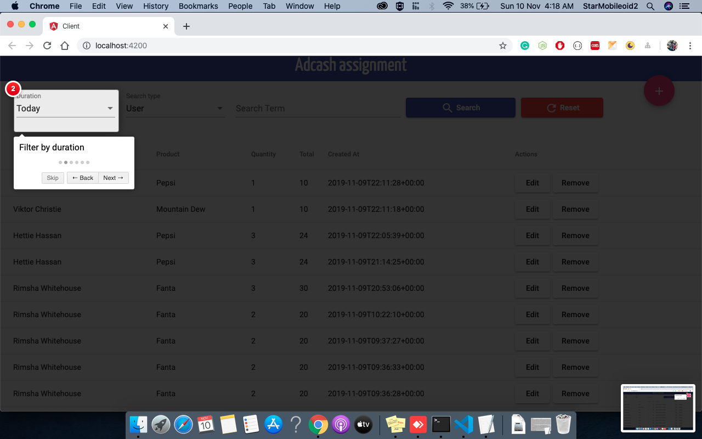
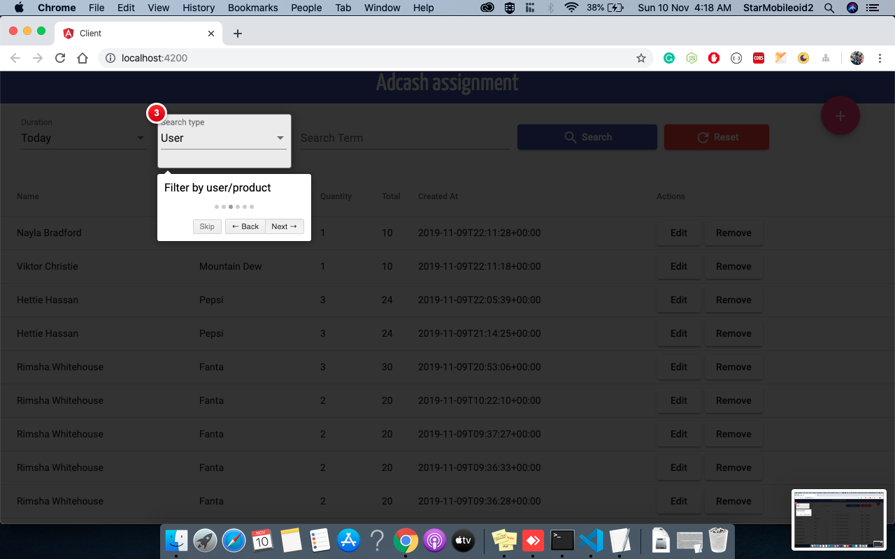
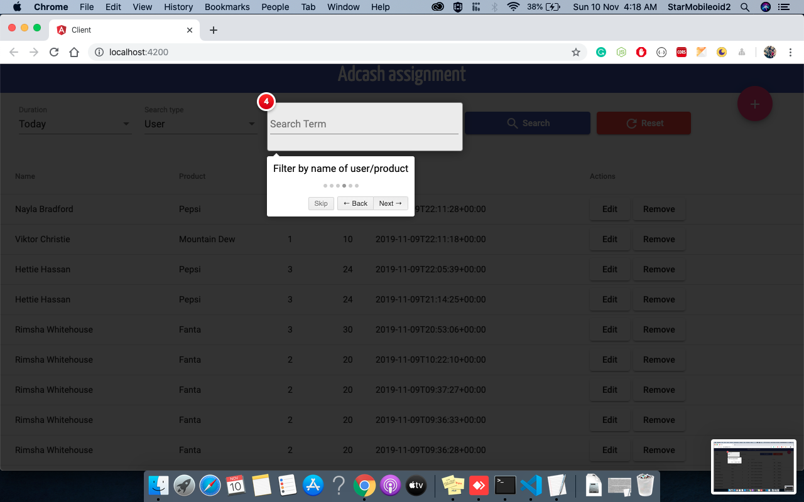
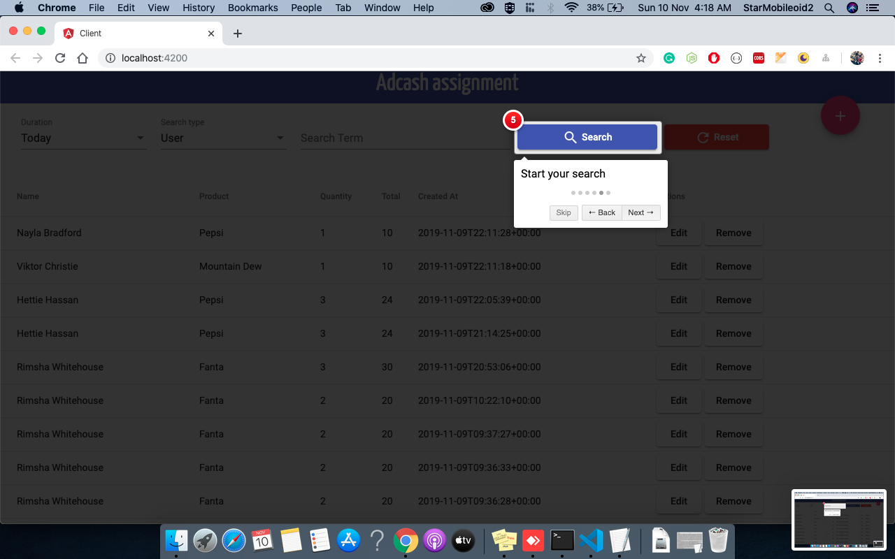
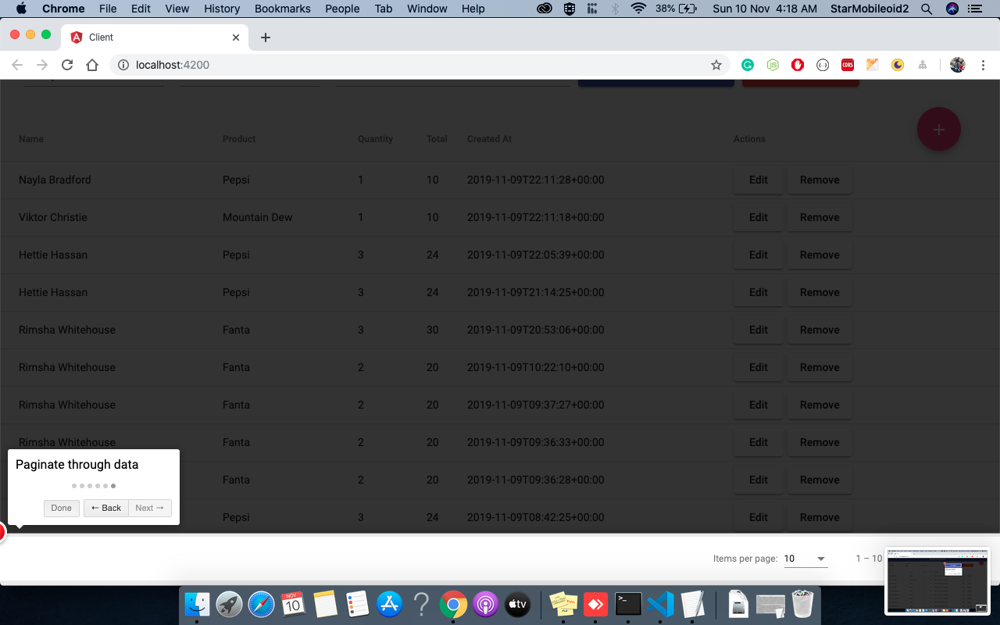
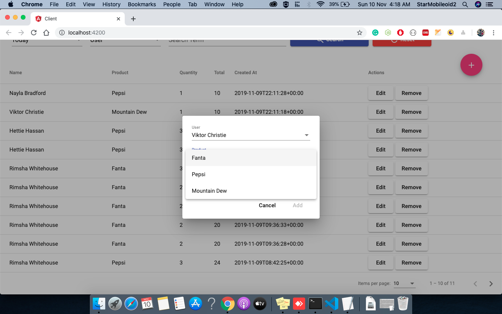
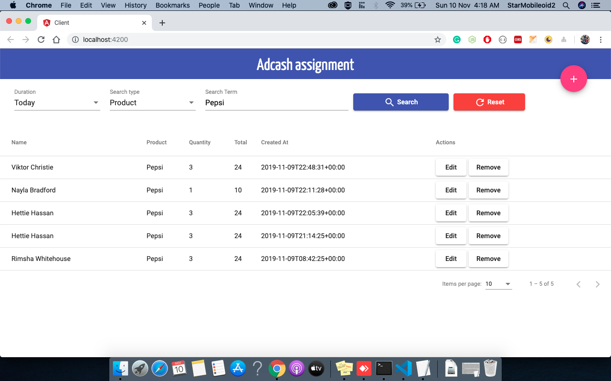
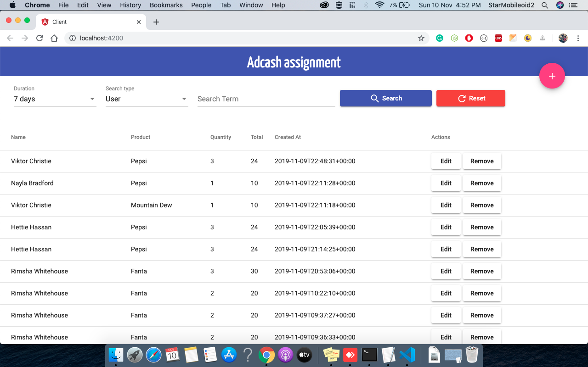

## Adcash assignment

## Structure
  - Client
    - Angular 8 application
  - Server
    - Symfony 4 Framework (Php 7.3)

## Setup To Test application

### Requirements
  - php > 7.3
  - node > 10
  - mysql 8
  - @angular/cli

### Steps
  - git clone
  - Create database adcash
  - Import adcash.sql into adcash database
  - Terminal one: cd client && npm install --verbose && ng serve --open `This will start server at 4200`
  - Terminal two: cd server && php bin/console server:run `This will start server at 8000`
  - Go to localhost:4200 and browser

### Images (Images folder has screenshots)
  - 
  - 
  - 
  - 
  - 
  - 
  - 
  - 
  -     

  
